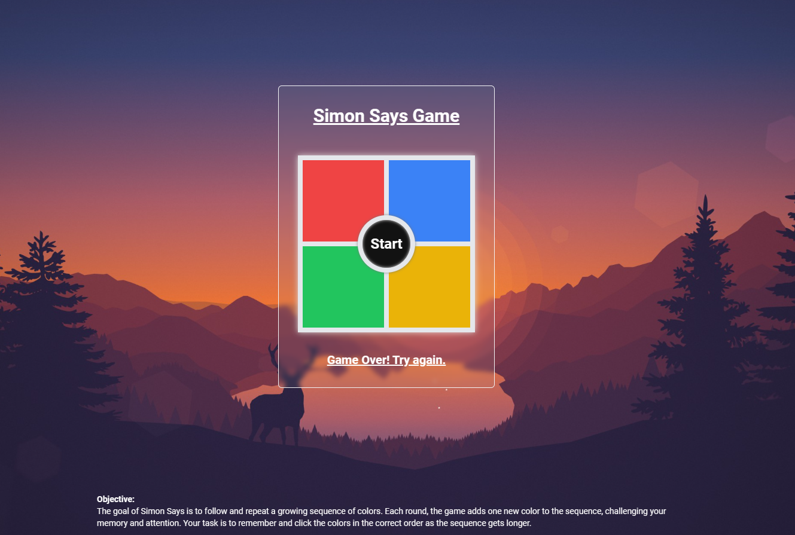

# Simon Says Game

This is a simple Simon Says game built with React and Tailwind CSS. The game challenges players to memorize and repeat a
sequence of colors that gets progressively longer with each round.

## How to Play

The goal of Simon Says is to follow and repeat a growing sequence of colors. Each round, the game adds one new color to
the sequence, challenging your memory and attention. Your task is to remember and click the colors in the correct order
as the sequence gets longer.

### Game Rules

1. **Start the Game**: Press the "Start" button to begin.
2. **Watch the Sequence**: The game will highlight a sequence of colors. Memorize this sequence.
3. **Repeat the Sequence**: Click the buttons in the same order as the sequence shown.
4. **Progress Through Rounds**: If you repeat the sequence correctly, a new color will be added to the sequence, and the
   next round begins. If you make a mistake, the game will reset.
5. **Complete All Rounds**: Successfully repeating the sequence for 8 rounds will complete the game.

## Live Demo

You can play the live version of the game [here](https://your-live-demo-link.com).

## Screenshots



## Setup and Installation

To set up and run the game locally, follow these steps:

### Prerequisites

- Node.js and npm should be installed on your machine.

### Installation

1. **Clone the Repository**:

   ```bash
   git clone https://github.com/yourusername/simon-says-game.git
   cd simon-says-game
   ```

2. **Install Dependencies**:
   ```bash
   npm install
   ```

## Running the Game

To start the game, run the following command:

```bash
npm start
```

This will run the app in development mode. Open [http://localhost:5173](http://localhost:5173) to view it in the
browser.

## Code Explanation

### SimonSays Component

The `SimonSays` component manages the state and logic of the game, including:

- `gameSequence`: Stores the sequence of colors generated by the game.
- `userSequence`: Stores the sequence of colors clicked by the user.
- `gameRound`: Tracks the current round number.
- `message`: Displays messages to the user.
- `activeState`: Manages the active state of each button.

### Functions

- `shadowToggle(color)`: Toggles the visual state of a button.
- `handleColorClick(color)`: Handles the user's button click.
- `generateRandomColor()`: Generates a random color.
- `handleStart()`: Starts a new game.

### useEffect

This hook monitors changes in the user's sequence, validates it against the game's sequence, and progresses to the next
round if correct.
=======
Simon Says Game
This is a simple Simon Says game built with React and Tailwind CSS. The game challenges players to memorize and repeat a sequence of colors that gets progressively longer with each round.

Table of Contents
How to Play
Setup and Installation
Running the Game
Screenshots
Live Demo
How to Play
The goal of Simon Says is to follow and repeat a growing sequence of colors. Each round, the game adds one new color to the sequence, challenging your memory and attention. Your task is to remember and click the colors in the correct order as the sequence gets longer.

Game Rules
Start the Game: Press the "Start" button to begin.
Watch the Sequence: The game will highlight a sequence of colors. Memorize this sequence.
Repeat the Sequence: Click the buttons in the same order as the sequence shown.
Progress Through Rounds: If you repeat the sequence correctly, a new color will be added to the sequence, and the next round begins. If you make a mistake, the game will reset.
Complete All Rounds: Successfully repeating the sequence for 8 rounds will complete the game.
Setup and Installation
To set up and run the game locally, follow these steps:

Prerequisites
Node.js and npm should be installed on your machine.
Installation
Clone the Repository:

bash
Copy code
git clone https://github.com/yourusername/simon-says-game.git
cd simon-says-game
Install Dependencies:

bash
Copy code
npm install
Running the Game
To start the game, run the following command:

bash
Copy code
npm start
This will run the app in development mode. Open http://localhost:3000 to view it in the browser.

Screenshots
[public/readme.png]
Live Demo
You can play the live version of the game here.

Code Explanation
SimonSays Component
The SimonSays component manages the state and logic of the game, including:

gameSequence: Stores the sequence of colors generated by the game.
userSequence: Stores the sequence of colors clicked by the user.
gameRound: Tracks the current round number.
message: Displays messages to the user.
activeState: Manages the active state of each button.
Functions
shadowToggle(color): Toggles the visual state of a button.
handleColorClick(color): Handles the user's button click.
generateRandomColor(): Generates a random color.
handleStart(): Starts a new game.
useEffect
This hook monitors changes in the user's sequence, validates it against the game's sequence, and progresses to the next round if correct.
>>>>>>> 9296de724dc8d6aea77b86718cbcaf0b0b80655e
